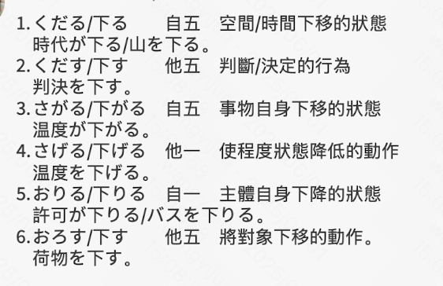

1. 「下りる」「降りる」「落ちる」「落とす」？「下がる」

   ​	// 下面是GPT生成的，正确性待验证

   1. **下がる（さがる）**
      1. **类型**：自动词，1类动词
      2. **常用情况**：表示某物自己下降或降低
      3. **例句**：気温が下がる（きおんがさがる）- 气温下降
   2. **下げる（さげる）**
      1. **类型**：他动词，2类动词
      2. **常用情况**：表示使某物下降或降低
      3. **例句**：音量を下げる（おんりょうをさげる）- 调低音量
   3. **下る（くだる）**
      1. **类型**：自动词，1类动词
      2. **常用情况**：表示从高处向低处移动，或时间的推移
      3. **例句**：坂を下る（さかをくだる）- 下坡
   4. **下す（くだす）**
      1. **类型**：他动词，1类动词
      2. **常用情况**：做出决定或判断
      3. **例句**：決断を下す（けつだんをくだす）- 做出决定
   5. **降りる（おりる）**
      1. **类型**：自动词，2类动词
      2. **常用情况**：表示从高处下来，或从交通工具上下来
      3. **例句**：バスを降りる（ばすをおりる）- 下公交车
   6. **下りる（おりる）**
      1. **类型**：自动词，2类动词
      2. **常用情况**：表示许可、批准等被给予，或障碍物被移除
      3. **例句**：許可が下りる（きょかがおりる）- 获得许可
   7. **落とす（おとす）**
      1. **类型**：他动词，1类动词
      2. **常用情况**：表示使某物掉落或降低
      3. **例句**：財布を落とす（さいふをおとす）- 掉钱包
   8. **落ちる（おちる）**
      1. **类型**：自动词，2类动词
      2. **常用情况**：表示某物自己掉落或下降
      3. **例句**：葉が落ちる（はがおちる）- 叶子掉落
   9. **下ろす（おろす）**
      1. **类型**：他动词，1类动词
      2. **常用情况**：表示从高处拿下或卸下某物
      3. **例句**：荷物を下ろす（にもつをおろす）- 卸货